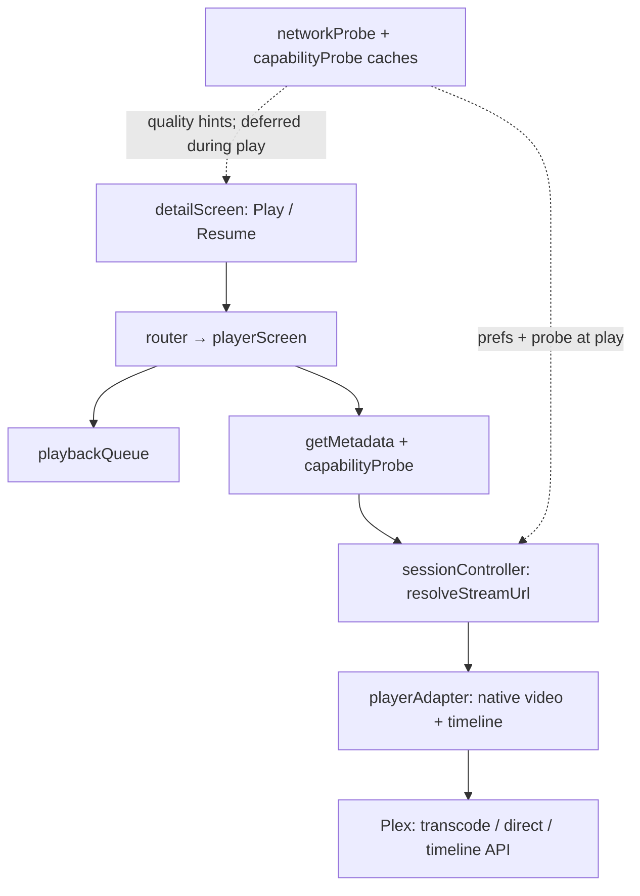

# XPlay 2 Video Player — Consolidated Review Summary

**Scope:** webOS TV Plex client playback stack (`src/playback/`, `playerScreen.js`, related UI and settings).  
**Review date:** May 2026.  
**Implementation pass:** 60 tests pass (`npm test`).

---

## 1. Executive summary

- **Solid foundation:** Single native `<video>` element, Plex universal transcode (HLS + HTTP fallback), structured modules (`sessionController`, `playerAdapter`, probes, queue), and a deliberate webOS decoder teardown order documented in `docs/caching-and-buffering.md`.
- **Security hardening shipped:** Plex `X-Plex-Token` is redacted in playback error logs, `onError` payloads, and `getPlaybackStats().url` via `redactPlexUrl()` in `playerAdapter.js`.
- **Reliability UX improved:** “Preparing playback” overlay waits for first frame; buffering overlay refcount no longer cleared by route loading; background visibility pauses playback; stale async restarts are ignored via `playbackGeneration`; queue next/prev flushes Plex progress before advancing.
- **TV table-stakes gaps partially closed:** In-player **Start over**, **Mark watched**, and **Retry**; timeline sync failures surface to the user; network probes defer during active playback; playback prefs are clamped/whitelisted.
- **Largest remaining product gaps:** Thumbnail trick-play scrubbing, soft subtitles on remux/transcode, chapter navigation, one-key Continue Watching resume, and playback speed controls.
- **Largest remaining engineering risks:** Probe recommendations are not wired into the player’s initial quality/mode; overlapping restarts are mitigated via generation + session capture (full mutex still optional); transcode seek still restarts the session (scrub Enter debounced ~300 ms).
- **Test coverage:** Playback logic remains lightly tested in CI (mostly `capabilityProbe` / version gate in `test/b8-compat.test.js`); player adapter, session URLs, timeline sync, and `playerScreen` orchestration need dedicated tests.

---

## 2. Architecture at a glance

Playback flows from the detail screen into a ~1,650-line orchestrator that builds Plex sessions, drives the native video element, and runs automatic fallback ladders on errors and rebuffer timeouts.

**High-risk files (prioritize future changes):**

| File                                | Why                                                    |
| ----------------------------------- | ------------------------------------------------------ |
| `src/ui/screens/playerScreen.js`    | Orchestration, fallbacks, queue, overlays, remote keys |
| `src/playback/playerAdapter.js`     | Video lifecycle, seek, timeline, scrobble, subtitles   |
| `src/playback/sessionController.js` | URL construction, strategy selection, transcode params |
| `src/playback/networkProbe.js`      | Bandwidth measurement, quality recommendations, cache  |
| `src/playback/capabilityProbe.js`   | Pre-play codec/container feasibility                   |

---

## 3. Implemented fixes

Verified against the implementation pass diff (May 2026).

| Fix                                          | Files                                                   | Notes                                                                                                 |
| -------------------------------------------- | ------------------------------------------------------- | ----------------------------------------------------------------------------------------------------- |
| Redact Plex token in errors and stats        | `playerAdapter.js`                                      | `redactPlexUrl()` on `console.error`, `onError` `url`, `getPlaybackStats().url`                       |
| First-frame loading overlay                  | `playerAdapter.js`, `playerScreen.js`                   | `onFirstFrame` (`canplay` / `playing`); `hidePrepareOverlayIfReady()`                                 |
| Buffering refcount not cleared by route hide | `loadingOverlay.js`                                     | `hideLoadingOverlay()` no longer zeroes `bufferDepth`                                                 |
| Background / visibility pause                | `playerScreen.js`, `webos.js`                           | `onAppBackground()` → pause when hidden; no auto-resume on return                                     |
| Stale playback restart guard                 | `playerScreen.js`                                       | `playbackGeneration` + `isStalePlayback()` on `tryPlayback` / `restartPlaybackAt`                     |
| Seek listener leak + paused timeline state   | `playerAdapter.js`                                      | `cancelPendingSeek()`, `{ once: true }`; `syncTimeline` uses paused vs playing                        |
| Queue advance flushes Plex progress          | `playerAdapter.js`, `playerScreen.js`                   | `flushProgress('stopped')` before `stop({ skipTimeline: true })`                                      |
| In-player Start over                         | `playerScreen.js`                                       | More menu → `restartPlaybackAt(0)`                                                                    |
| In-player Mark watched                       | `playerScreen.js`                                       | More menu → `markWatched`                                                                             |
| Manual Retry on terminal failure             | `playerScreen.js`, `app.css`                            | Resets fallback flags, restarts playback; focused retry button                                        |
| Timeline sync failure message                | `playerAdapter.js`, `playerScreen.js`                   | `onTimelineSyncFailure` → user-visible status                                                         |
| Defer network probes during playback         | `networkProbe.js`, `playerScreen.js`                    | `setPlaybackActive(true/false)`; skips/deferrs 512 KiB downloads                                      |
| Probe quality wired at play (auto prefs)     | `networkProbe.js`, `playerScreen.js`, `detailScreen.js` | Per-title cache (`ratingKey`+`versionId`); `ensureItemProbeForPlay`; `resolveInitialPlaybackStrategy` |
| Cancel boot/session probe on player route    | `networkProbe.js`, `playerScreen.js`                    | `cancelNetworkProbe()` before play; `setPlaybackActive(true)` after item probe                        |
| Range probe byte cap + streaming read        | `networkProbe.js`                                       | `readCappedResponseBody()` caps at `PROBE_BYTES`; rejects 200 when `Content-Length` exceeds cap       |
| Playback prefs validation                    | `playbackSettings.js`                                   | Whitelist `quality` / `subtitleSize`; clamp `subtitleOffsetMs` ±5000 ms                               |
| Autoplay countdown duration                  | `playerScreen.js`                                       | Renders initial 10s then decrements each second (true 10s window)                                     |
| Defer first `playing` timeline sync          | `playerAdapter.js`                                      | Until `playing` or `currentTime > 0`; not at `play()` return                                          |
| Rebuffer watchdog multi-stall                | `playerAdapter.js`                                      | `rebufferFired` cleared in `notifyBuffering(false)`                                                   |
| App background pause hook                    | `webos.js`, `playerScreen.js`                           | `onAppBackground()` documents visibility-only policy                                                  |
| Queue `advancing` through first frame        | `playerScreen.js`                                       | `chainPlaybackReady` + `waitForFirstFrame`; `loadAndPlay` returns full chain                          |
| Autoplay cancel stays on ended UI            | `playerScreen.js`                                       | No `exitPlayer()` when `autoplayCancelled` and `queue.hasNext()`                                      |
| `destroy()` flushes timeline when needed     | `playerScreen.js`                                       | `flushProgress('stopped')` before teardown when `session` remains                                     |
| Restart session capture at `playUrl`         | `playerScreen.js`                                       | `tryPlayback` snapshots `session`; `isLadderFallbackStreamChange` for `subtitle-fallback`             |
| Overlay hide after first frame               | `playerScreen.js`                                       | `overlayHideAfterFirstFrame` gate; no mount `scheduleOverlayHide`                                     |
| Transcode scrub commit debounce              | `playerScreen.js`                                       | ~300 ms on seek bar Enter before `restartPlaybackAt`                                                  |

---

## 4. Open issues by priority

Duplicates across performance, correctness, security, and deep reviews are merged into one row each. Status reflects the implementation pass unless noted.

### Critical

| Issue                                                          | Area                                     | Recommendation                                              | Status                                               |
| -------------------------------------------------------------- | ---------------------------------------- | ----------------------------------------------------------- | ---------------------------------------------------- |
| Range probe may download entire file if server ignores `Range` | `networkProbe.js`                        | Require HTTP 206, cap bytes read, or abort after probe size | **Fixed**                                            |
| Plex token in media URLs (required for `<video src>`)          | `plex/client.js`, `sessionController.js` | Keep tokens out of logs/UI; never log raw `videoEl.src`     | **Fixed** (redaction); URL shape unchanged by design |

### High

| Issue                                                         | Area                                                    | Recommendation                                                                     | Status                                                                               |
| ------------------------------------------------------------- | ------------------------------------------------------- | ---------------------------------------------------------------------------------- | ------------------------------------------------------------------------------------ |
| Probe “recommended quality” not applied at play               | `detailScreen.js`, `playerScreen.js`, `networkProbe.js` | Wire `recommendedQualityId` into initial session/profile or show explicit override | **Fixed**                                                                            |
| Overlapping `restartPlaybackAt` / fallback races              | `playerScreen.js`                                       | `playbackGeneration` reduces stale `play()`; consider full restart queue/mutex     | **Partial** — generation + session capture at `playUrl`                              |
| Queue `advancing` cleared before playback starts              | `playerScreen.js`                                       | Hold `advancing` until `tryPlayback` chain completes                               | **Fixed** — through first frame                                                      |
| Probe cancel ineffective mid-download                         | `networkProbe.js`                                       | `AbortController` on `fetch`; cooperative cancel during read                       | **Open**                                                                             |
| Boot/item probe competes with playback (bandwidth)            | `networkProbe.js`, `bootstrapScreen.js`                 | Defer during play (done); also cancel boot probe on player route                   | **Fixed** — defer + `cancelNetworkProbe()` on player entry                           |
| Auto mode ignores measured Mbps at start                      | `playerScreen.js`, `networkProbe.js`                    | Consult probe before `direct` / `direct-stream` when quality is `auto`             | **Fixed**                                                                            |
| Session probe uses continue-watching asset, not current title | `networkProbe.js`                                       | Per-title probe before play or invalidate session cache on version change          | **Fixed**                                                                            |
| Autoplay cancelled → still exits player when queue has next   | `playerScreen.js`                                       | On end with `autoplayCancelled`, hold on ended frame instead of `exitPlayer()`     | **Fixed**                                                                            |
| `destroy()` always `skipTimeline`                             | `playerScreen.js`                                       | Document invariant (`exitPlayer` must run first) or flush in `destroy`             | **Fixed** — flush when `session` remains                                             |
| Transcode seek = full session restart (UX cost)               | `playerScreen.js`, `sessionController.js`               | Debounce scrub commits; document; use Plex `fastSeek` where possible               | **Partial** — ~300 ms Enter debounce on transcode                                    |
| Rebuffer watchdog fires once per `play()` session             | `playerAdapter.js`                                      | Reset `rebufferFired` when buffering clears; optional profile downshift            | **Fixed** — resets on `notifyBuffering(false)`; profile downshift still open         |
| Timeline `playing` before decode ready                        | `playerAdapter.js`                                      | Defer first `syncTimeline('playing')` until `playing` or `currentTime > 0`         | **Fixed**                                                                            |
| No TV suspend integration beyond visibility pause             | `playerScreen.js`, `platform/webos.js`                  | webOS-specific lifecycle hooks if available; sync paused state                     | **Fixed** — `onAppBackground()` (visibility); webOSTV.js has no separate suspend API |

### Medium

| Issue                                                            | Area                                       | Recommendation                                                        | Status                                                                             |
| ---------------------------------------------------------------- | ------------------------------------------ | --------------------------------------------------------------------- | ---------------------------------------------------------------------------------- |
| Short content (<30s) may scrobble immediately                    | `playerAdapter.js`, `scrobblePolicy.js`    | Minimum watch time before `markWatched` at 92% threshold              | **Fixed** — near-end rule only when duration >30s                                  |
| Client `addTextTrack` accumulation                               | `playerAdapter.js`                         | Remove/disable orphan text tracks on subtitle change                  | **Fixed** — disable/clear all `textTracks` in `clearSubtitles`                     |
| Transcode offset possibly applied twice (URL + client seek)      | `playerAdapter.js`, `playbackOffset.js`    | Skip client `applyPlaybackOffset` for transcode when URL has `offset` | **Fixed**                                                                          |
| Duration mismatch: UI vs Plex metadata                           | `playerScreen.js`, `playerAdapter.js`      | Single canonical duration per playback mode                           | **Fixed** — `getCanonicalDurationMs()` (Plex meta for transcode; video for direct) |
| Missing bitrate treated as within LG limits                      | `lgBitrateLimits.js`, `capabilityProbe.js` | Conservative default when `bitrate` absent                            | **Fixed** — unknown blocks direct play; direct stream still allowed                |
| `onError` payload shape differs (`play()` reject vs media error) | `playerAdapter.js`, `playerScreen.js`      | Normalize error object for fallback ladder                            | **Fixed** — `normalizePlaybackError()`                                             |
| `restartPlaybackAt` drops timeline between interval syncs        | `playerScreen.js`                          | Optional `flushProgress` before `skipTimeline` stop                   | **Fixed** — matches queue advance path                                             |
| Strict direct-play still calls `play()` when probe says no       | `playerScreen.js`                          | Short-circuit before `play()` when strict + infeasible                | **Fixed**                                                                          |
| Monolithic `playerScreen.js` (~1,650 LOC)                        | `playerScreen.js`                          | Extract fallback state machine and queue lifecycle                    | **Deferred** (refactor)                                                            |
| CC / forced / SDH subtitle semantics                             | `subtitleTracks.js`, UI                    | Explicit Plex stream role handling                                    | **Partial** — parse flags, default pick, display labels                            |
| Connection quality only pre-play                                 | `networkProbe.js`, UI                      | In-play banner on sustained rebuffer or timeline failure              | **Partial** — timeline message only                                                |

---

## 5. Table-stakes feature status

Compact category-level view (post-implementation where noted).

| Category                                                   | Status      | Notes                                                               |
| ---------------------------------------------------------- | ----------- | ------------------------------------------------------------------- |
| Transport and formats (direct, HLS, HTTP transcode, remux) | **Present** | Auto fallback ladder on error/rebuffer                              |
| Quality levels / adaptive bitrate                          | **Partial** | Manual profiles; native HLS only; no rendition UI                   |
| Codec / container checks                                   | **Present** | `capabilityProbe`, `lgBitrateLimits`, webOS `canPlayType`           |
| Play / pause / seek / skip                                 | **Present** | Scrub bar, ±10s/30s UI, remote FF/RW                                |
| Restart from beginning                                     | **Partial** | Detail “Play from start”; in-player **Start over** added            |
| Playback speed                                             | **Missing** | No `playbackRate` control                                           |
| Resume / Continue Watching / scrobble                      | **Present** | `viewOffset`, 10s timeline, 92% scrobble                            |
| Mark watched                                               | **Partial** | Detail + auto-scrobble; in-player **Mark watched** added            |
| Chapter markers                                            | **Missing** | Intro/credit markers only                                           |
| Quality / audio / subtitle pickers                         | **Present** | In-player menus; transcode restart on change                        |
| Subtitle styling / offset                                  | **Present** | Size, background, ±100 ms in player; prefs clamped                  |
| Client soft subs                                           | **Partial** | Direct play only; burn-in for image subs / transcode                |
| Trick-play thumbnails                                      | **Missing** | Time + bar only                                                     |
| Skip intro / credits                                       | **Present** | Plex markers + remote keys                                          |
| Full-screen / overlay / remote / focus                     | **Present** | 3s overlay hide; exit confirm stops playback                        |
| Buffering indicator                                        | **Present** | Refcounted overlay; refcount bug fixed                              |
| Error recovery                                             | **Partial** | Auto ladder **Present**; manual **Retry** added                     |
| Background pause                                           | **Partial** | `onAppBackground` pause (Page Visibility); no auto-resume on return |
| Accessibility (CC pipeline, AD tracks)                     | **Partial** | WebVTT from SRT on direct play; no AD                               |

---

## 6. Deferred / out of scope

- Thumbnail / storyboard scrubbing during seek.
- Soft subtitles on HLS remux and full transcode without full restart UX.
- Chapter navigation from Plex chapter metadata.
- One-key resume from Continue Watching hub rows (skip detail).
- Audio description track selection.
- Playback speed control on TV.
- Offline / download playback.
- Full refactor of `playerScreen.js` into smaller testable modules (recommended as incremental extraction, not a big-bang rewrite).

---

## 7. Recommended next steps

1. **Harden `measurePartDownload`:** Enforce 206 + byte cap; reject unbounded `arrayBuffer()` (addresses OOM and probe/playback contention).
2. **Wire probe recommendations into play:** Use `recommendedQualityId` (or explicit user override) in `playerScreen` / `createSession` so detail UI and first frame match.
3. ~~**Fix autoplay-cancel end behavior**~~ — done: stay on ended episode UI when countdown cancelled.
4. ~~**Hold `advancing` through `tryPlayback**`~~ — done: through first frame / `chainPlaybackReady`.
5. **Add `AbortController` to network probes:** Make `cancelNetworkProbe` stop in-flight downloads safely.
6. ~~**Defer first Plex `playing` timeline** until playback has actually started.~~ **Done** (May 2026 pass).
7. **Add playback unit tests:** `redactPlexUrl`, seek/timeline state, `flushProgress`, overlay refcount, `playbackGeneration` stale guard (mock video element).
8. **Consult probe Mbps for `auto` initial strategy:** Avoid progressive direct play when session probe advises transcode.
9. ~~**Reset rebuffer watchdog** after buffering clears~~ **Done**; consider one automatic profile downshift before terminal failure.
10. **Extract fallback state machine** from `playerScreen.js` (small module, no behavior change) to enable targeted tests.

---

## 8. Test gaps

- No automated tests for `playerAdapter.js` (play/stop/seek, timeline sync, scrobble threshold, `redactPlexUrl`, first-frame callbacks).
- No tests for `sessionController.js` URL building (direct vs HLS vs HTTP, offset ms, transcode params).
- No tests for `playerScreen.js` orchestration (fallback ladder flags, `playbackGeneration`, queue flush, overlay lifecycle).
- No tests for `networkProbe.js` cache TTL or `setPlaybackActive` deferral (Range cap + streaming read covered in `test/network-probe.test.js`).
- No integration tests for end-to-end play → error → HTTP fallback (would need mocked Plex + video).
- Existing coverage: `test/b8-compat.test.js` (version gate, `probePlayback` scenarios), `test/playback.test.js` (scrobble threshold, URL offset skip, `redactPlexUrl`, unknown bitrate, subtitle defaults), `scripts/validate-intro-markers.mjs`, `scripts/validate-compat.cjs` (bundle smoke checks).
- Suggested CI additions: session param builders; fake-timer tests for autoplay countdown and rebuffer watchdog.

---

## Appendix: Existing documentation

| Document                                       | Relevance                                         |
| ---------------------------------------------- | ------------------------------------------------- |
| `docs/caching-and-buffering.md`                | Buffer policy, rebuffer timeout, decoder teardown |
| `docs/webos-tv-spec-compliance.md`             | Codec / HLS compliance                            |
| `docs/compatibility-matrix.md`                 | Platform streaming matrix                         |
| `docs/agent-handoff-browse-playback-detail.md` | Browse/detail/play handoff notes                  |

