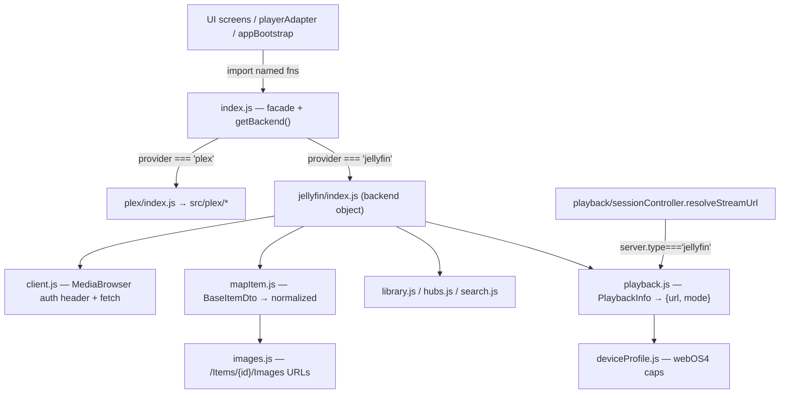

# src/backends — media-server adapter layer

## Purpose

This folder is the seam that lets the app speak **Plex OR Jellyfin** behind one
interface. The user picks a backend at first run (`getState().provider`); every
screen, the player, and the caches stay provider-agnostic by going through here.
Its responsibility ends at *data + playback URL + watch-state* — UI, routing, and
the player itself live elsewhere and never branch on provider.

> **Keep this file current** when: the `MediaBackend` method set changes, a Jellyfin
> stub graduates to a real implementation, the normalized item shape changes, or the
> playback/bitrate conventions change.

## Notable Patterns (read before editing)

- **One normalized vocabulary.** Every backend returns the shape produced by Plex's
  `mapLibraryItem` (`src/plex/library.js`). Jellyfin's `mapItem.js` translates
  `BaseItemDto` into that exact shape — so callers never see Jellyfin field names.
  If you add a field to the normalized item, add it to *both* mappers.
- **Bitrate is Kbps, always.** Plex reports Kbps natively; Jellyfin reports bits/s,
  so `mapItem` divides by 1000. Don't "fix" the division — the UI/quality code
  assumes Kbps. (`playback.js` multiplies back to bits/s for Jellyfin's API.)
- **The facade keeps call sites unchanged.** `index.js` exports call-time
  pass-throughs (`browseByType`, `getMetadata`, …) that dispatch to the active
  backend, plus a re-export of the shared shape-helpers (`getWatchStatus`,
  `getWatchProgressPercent`). Screens import these by name, not `getBackend()`.
- **Plex adapter is a thin re-export.** `plex/index.js` wires existing `src/plex/*`
  functions into the contract — no logic. All Plex behavior still lives in `src/plex`.
- **Auth is NOT routed through the backend object.** Each provider has its own
  onboarding screens that import their auth module directly (Plex PIN vs
  `jellyfin/auth.js`). The backend object is data + playback only.
- **Playback seam lives outside this folder.** `playback/sessionController.js`
  `resolveStreamUrl` branches `if (server.type === 'jellyfin')` → `getBackend()
  .resolveStreamUrl`. Watch-state/progress routes via the facade in
  `playback/playerAdapter.js`. Jellyfin bootstrap branches in `core/appBootstrap.js`.
- **Cache keys are provider-scoped** (`jf:<serverId>` in `jellyfin/library.js`) so
  the two backends never collide in the shared `core/cache.js`.

## Architecture

## Folder Map

- `plex/` — adapter that re-exports `src/plex/*` under the contract (no behavior).
- `jellyfin/` — the full Jellyfin implementation (auth, data, images, playback,
  device profile). The only place Jellyfin API knowledge lives.

## Key Types (modules)

| Module | Role |
|---|---|
| `interface.js` | JSDoc-only `MediaBackend` contract (documentation, not enforced). |
| `index.js` | `getBackend()` (resolves active backend) + named pass-throughs + shared shape-helper re-exports. |
| `plex/index.js` | `plexBackend` — binds `src/plex/*` functions to the contract. |
| `jellyfin/index.js` | `jellyfinBackend` object. Real: libraries/browse/metadata/children/hubs/search/images/playback/watch-state. **Stubs** (resolve empty/no-op): `refreshSection`/`refreshItem` (Jellyfin scan is admin-only), `getMetadataRelatedHubList`, `loadHubRows`, `prefetchHomeHubs`. |
| `jellyfin/client.js` | `fetchJellyfinJson`, `jfUrl`, `Authorization: MediaBrowser …` header, stable DeviceId. |
| `jellyfin/auth.js` | Server validation (`/System/Info/Public`), Quick Connect, `AuthenticateByName`, `/Users/Public`. |
| `jellyfin/mapItem.js` | `BaseItemDto` → normalized item (+ ticks→ms, bits→Kbps, parent-image fallback). |
| `jellyfin/playback.js` | PlaybackInfo decision → `{url, mode}` (`direct`/`transcode-hls`); `MaxStreamingBitrate` follows selected quality; progress + played/unplayed. |
| `jellyfin/deviceProfile.js` | Ported webOS-4 profile sent to PlaybackInfo (the contract that decides direct/remux/transcode). |

## In-Progress Work

| Item | Notes |
|---|---|
| Direct-play tuning | `deviceProfile.js` is conservative; the win is getting high-bitrate files to direct-play natively (no MSE) rather than transcode — see the device-profile codec gates. |
| Jellyfin "related"/recommendations | `getMetadataRelatedHubList` / `loadHubRows` are empty stubs. |
| webOS4 buffer | `playback/playerAdapter.js` clamps hls.js buffer on webOS4 for transcode streams (MSE quota). |

## Tests

| File | Focus |
|---|---|
| `test/jellyfin-mapitem.test.js` | `mapItem` field mapping against **real captured 10.11 `BaseItemDto`** (ticks→ms, bits→Kbps, type/hierarchy, image URLs). |
| `test/jellyfin-playback.test.js` | `buildStreamFromInfo` decision (direct vs transcode-hls, URL absolutize). |
| `test/managed-profile-regressions.test.js` | `startupRouting` provider gate (incl. jellyfin-needs-server). |

## Reference

`docs/jellyfin/integration-research.md` — the full Jellyfin REST API + field-mapping
spec and the webOS-4 device-profile derivation (the source these modules were built from).
