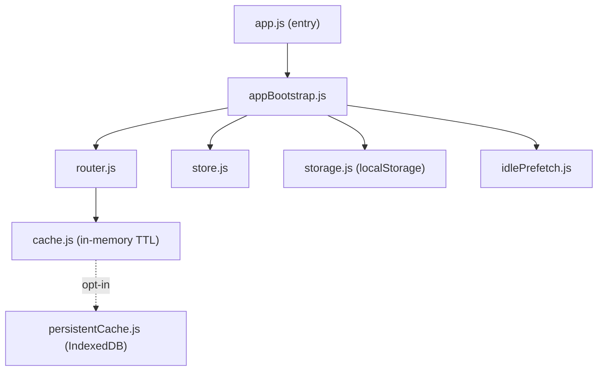

# AGENTS.md — src/core

## Purpose

Owns app lifecycle and cross-cutting infrastructure: startup sequencing, the
screen router, global state, the caching layers, and the Chrome53 polyfills.
Everything else (`plex`, `playback`, `ui`) is wired together here. Responsibility
ends at the screen boundary — individual screen logic lives in
[../ui/screens](../ui/screens/AGENTS.md).

*Keep this file up to date when:* the startup chain in `appBootstrap.js` changes,
the router's retention model changes, or a polyfill is added/removed.

## Notable Patterns

- **Screen-retention router (Kodi-style).** `router.js` keeps a `retainStack`
  (`MAX_RETAINED = 3`) of live screen instances instead of tearing down the DOM
  on every navigation. Browse screens are `retained=true` (kept alive on
  navigate-away); player / pairing / profile-picker are transient
  (`retained=false`, popped on leave). A separate `history` array tracks logical
  back breadcrumbs independent of the DOM stack. **Back-button bugs almost always
  trace to confusing these two structures** — read the file header before editing.
- **Two cache layers.** `cache.js` is the in-memory TTL cache used everywhere
  (TTLs documented in [docs/caching-and-buffering.md](../../docs/caching-and-buffering.md)).
  `persistentCache.js` (IndexedDB) is an *opt-in* backing impl wired via
  `setPersistentImpl`. It is **OFF by default** (`app.js` ~L139–155) because IDB
  hangs bootstrap on webOS4 — opt in with `localStorage.plax_enable_persistent='1'`
  or `?persist=1`. See memory `webos4-indexeddb-wedged`.
- **Polyfills load first.** `stringPolyfills.js`, `promiseFinallyPolyfill.js`,
  `abortControllerPolyfill.js` patch Chrome53 gaps. The AbortController polyfill
  does **not** make legacy fetch honor `signal` — timeouts use `Promise.race`
  (see [../utils](../utils/AGENTS.md) `fetch.js`).

## Architecture

## Key Types / Files

| File | Role |
|---|---|
| `app.js` | Entry point; initializes platform, router, store, registers screens, wires cache impl |
| `appBootstrap.js` | Multi-step startup chain |
| `router.js` | Retention stack + logical history; back-button handling |
| `store.js` | Minimal global state (`getState`/`setState`) — auth, platform, prefs |
| `storage.js` | localStorage wrappers (auth token, home user, server cache) |
| `cache.js` | In-memory TTL cache for Plex responses |
| `persistentCache.js` | IndexedDB backing (opt-in; off by default) |
| `idlePrefetch.js` | Prefetch home hubs/recommendations on idle |
| `startupRouting.js` | Resolve startup route (pairing vs home) |
| `startupBuildLog.js` | Parse UA → Chromium major for boot log |
| `*Polyfill*.js` / `stringPolyfills.js` | Chrome53 runtime backfills |
