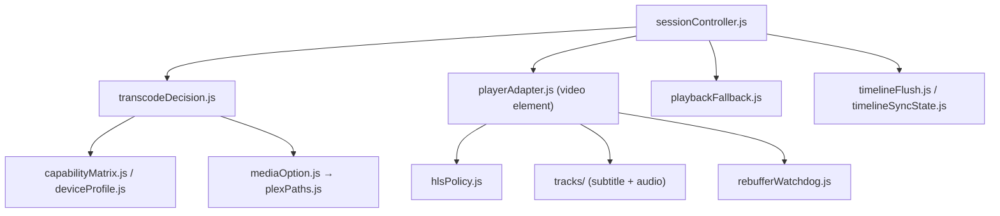

# AGENTS.md — src/playback

## Purpose

The largest and most intricate module. Owns everything between "user pressed play"
and pixels on screen: the quality/transcode decision tree, the playback session
state machine, the `<video>` adapter, HLS handling, device capability detection,
and audio/subtitle tracks. The player **screen** (overlay UI) lives in
[../ui/screens](../ui/screens/AGENTS.md) `playerScreen.js`; this folder is the
engine behind it.

*Keep this file up to date when:* the direct-play→transcode decision logic
changes, the fallback chain changes, or capability/bitrate tables are revised.

## Notable Patterns

- **Three-tier delivery decision:** direct play (original file, progressive URL,
  zero transcode) → HLS direct stream / remux → server transcode. "Auto" quality
  walks the whole chain; "Direct play only" / "Original" never auto-fall-back.
  Logic in `transcodeDecision.js` + `parseTranscodeDecision.js`; capability gating
  in `capabilityMatrix.js` / `deviceProfile.js` / `capabilityProbe.js`.
- **Capability is per webOS major.** `capabilityMatrix.js` and `lgBitrateLimits.js`
  encode codec/container/bitrate support by version (e.g. webOS4 LAN bitrate cap).
  Cross-check claims against [docs/compatibility-matrix.md](../../docs/compatibility-matrix.md).
- **HLS on webOS uses native `<video>`, not hls.js, for the Plex `start.m3u8`
  path.** `hlsPolicy.js` patches manifests for Chrome53 compatibility. Only mpegts
  HLS works on B8 — fMP4 and progressive transcode fail (memory
  `webos4-transcode-delivery`). hls.js exists as a dependency but is webOS5+.
- **Subtitle/MKV traps:** auto-selected PGS subtitles force a transcode; `<video>`
  cannot demux MKV containers. See `tracks/subtitleTracks.js` and memory
  `webos4-directplay-subtitle-and-mkv` + [docs/plex-subtitle-transcode.md](../../docs/plex-subtitle-transcode.md).
- **Fallback is a state machine.** `sessionController.js` coordinates play/pause/
  seek and restarts at a lower preset on error; `playbackFallback.js` +
  `playbackRestartLock.js` prevent cascading restarts.

## Architecture

## Key Files

| File | Role |
|---|---|
| `sessionController.js` | Play/pause/seek coordination + error→fallback state machine |
| `playerAdapter.js` | `<video>` wrapper: events, HLS.js (webOS5+), cue injection, timeline sync |
| `playerFactory.js` | Constructs the player/session for a media item |
| `hlsPolicy.js` | HLS manifest probe + Chrome53 patching |
| `transcodeDecision.js` / `parseTranscodeDecision.js` | Direct-play vs remux vs transcode |
| `capabilityMatrix.js` / `capabilityProbe.js` / `deviceProfile.js` | Device codec/container/bitrate support |
| `qualityProfiles.js` | Quality presets (Auto/Original/4K/1080p/720p/480p) |
| `lgBitrateLimits.js` | Bitrate caps by webOS major |
| `mediaOption.js` / `plexPaths.js` | Build playback URLs (direct/transcode/stream) |
| `introMarkers.js` | Plex intro/credit marker extraction |
| `storyboard.js` | Seek-preview thumbnail fetch/decode |
| `playbackFallback.js` / `playbackRestartLock.js` | Lower-quality restart + de-dup |
| `timelineFlush.js` / `timelineSyncState.js` / `scrobblePolicy.js` | Progress POST + scrobble |
| `rebufferWatchdog.js` | Buffering-timeout detection |
| `autoplayCountdown.js` / `playbackQueue.js` / `queueAdvance.js` | Next-episode autoplay/queue |

## Folder Map

- `tracks/` — `subtitleTracks.js` (SRT/ASS/VTT fetch + TextTrack injection + offset,
  transcode fallback), `srtParser.js`, `audioTracks.js`, `streamUtils.js`.

## Related docs

- [docs/player-review-summary.md](../../docs/player-review-summary.md)
- [docs/compatibility-matrix.md](../../docs/compatibility-matrix.md)
- [docs/plex-subtitle-transcode.md](../../docs/plex-subtitle-transcode.md)
