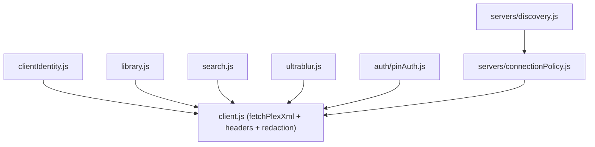

# AGENTS.md — src/plex

## Purpose

The single boundary for all Plex Media Server communication: HTTP client, library
and hub fetching, search, account/PIN auth, server discovery, and connection
policy. All metadata and artwork come from PMS only (no external TMDB). Playback
URL construction lives in [../playback](../playback/AGENTS.md); this folder
fetches data and hands it off.

*Keep this file up to date when:* a Plex endpoint is added/changed, the cache
keying or invalidation rules change, or the discovery/connection policy changes.

## Notable Patterns

- **Auth tokens are layered.** `client.js` `getToken()` prefers the active Plex
  Home user's `authToken`, falls back to the account token; per-server requests
  may use the server's `accessToken`. URLs are redacted before logging
  (`X-Plex-Token` stripped).
- **Cache is keyed by server.** Responses cached via [../core](../core/AGENTS.md)
  `cache.js` are scoped per server identifier/URI. Watch-sensitive hubs (Continue
  Watching, On Deck) must be invalidated when watch state changes; section refresh
  flushes hubs. Don't introduce a global cache key across servers.
- **Connection policy decides LAN vs remote, secure vs insecure.** `servers/
  connectionPolicy.js` chooses the endpoint based on user network prefs (see
  [../settings](../settings/AGENTS.md)); secure/insecure matters for LAN 4K.
- **XML, not JSON.** PMS returns XML; parsed via [../utils](../utils/AGENTS.md)
  `xml.js`. Hubs come from `/hubs/promoted` (+ per-hub `key`), related from
  `/hubs/metadata/{id}/related`, search from `/hubs/search`.

## Architecture

## Key Files

| File | Role |
|---|---|
| `client.js` | HTTP client: headers, token resolution, URL redaction, error mapping |
| `clientIdentity.js` | Build Plex client identity (clientId, product, version) |
| `library.js` | Sections, metadata, children, hubs, related, mark-watched, refresh, timeline |
| `search.js` | `/hubs/search` (movies/shows/episodes) with section-scoped fallback |
| `ultrablur.js` | Background blur-poster fallback (direct-URL path) — memory note: restore via direct URL, not IDB |

## Folder Map

- `auth/` — `pinAuth.js`: PIN flow against `plex.tv/link` (polling).
- `servers/` — `discovery.js` (server discovery + endpoint resolution),
  `connectionPolicy.js` (LAN/remote, secure/insecure choice).
- `recommendations/` — recommendation hub fetch.
- `users/` — Plex Home user management. Restricted child-user library access is
  enforced in `src/security/libraryAccess.js`.
